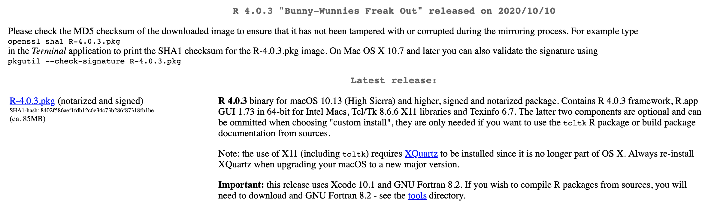
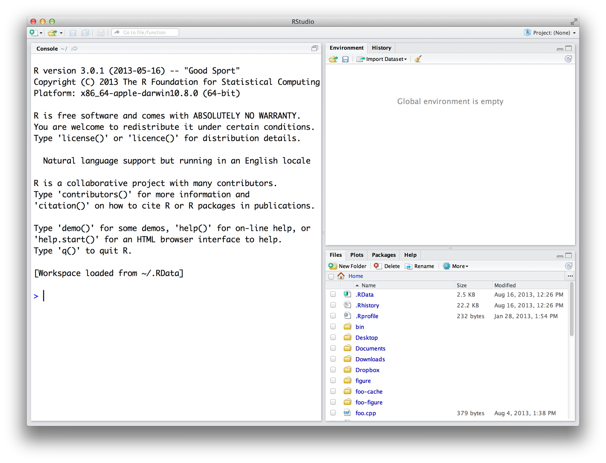
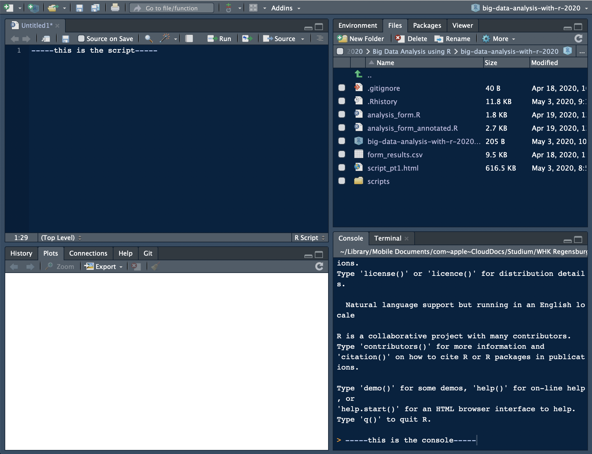

```{r setup, include=FALSE}
knitr::opts_chunk$set(echo = TRUE)
```

# Introductory remarks

Dear student, 
in the following, you will receive a gentle introduction to R. In the first part, I will start with what RStudio is and how you can install it, plus some recommended settings. Then I will introduce you to stuff I wish I had known earlier, as it makes my daily life a million times easier: RStudio projects and GitHub. Since the course requires you to hand in take-home exams written in RMarkdown, a brief tutorial is added as well. After you have familiarized yourself with these things, we can go *in medias res* and start out with actual R coding: how to install packages, how to perform arithmetic operations in R, how to assign values to objects, and the different classes of objects.

There are loads of resources online and I do not claim this introduction to be exhaustive. To acknowledge this shortcoming, every part ends with links leading you to further resources. However, the fact that I included them probably means that I have read them and more or less integrated their content into the tutorial -- so keep striving for more resources (and send me links)!

In general, this tutorial was heavily inspired by Richard Cotton's "Learning R" [@cotton2013] and Hadley Wickham's and Garrett Grolemund's "R for Data Science" (abbreviated with R4DS). The latter can be found [online](https://r4ds.had.co.nz) [@wickham2016a]. We will not immediately start out with the packages from the `tidyverse` (although [some strong points](http://varianceexplained.org/r/teach-tidyverse/) have been made in favor of doing so right from the start). I will rather try to build some sort of foundation from where we can proceed to the tidy packages in the following lessons. Hence, one can also understand this tutorial as an introduction to the `tidyverse` [@wickham2019c] (or `hadleyverse`, as it was named originally), even though I will not introduce it in this very first part. 
When it comes to what I would refer to as the "daily workflow" with R and RStudio, Jennifer Bryan's blog articles have been a big inspiration for me. You will stumble across her work when we deal with the `purrr` package as well.  
When looking at RMarkdown, I will mainly build on "R Markdown: The Definitive Guide" -- which is also freely available online [@xie2018].

# Getting started: installing R and RStudio

## R

For downloading R, just visit the website of the [Comprehensive R Archive Network (CRAN)](https://cran.r-project.org). CRAN is simply a network of ftp and web servers all around the world. Here, things related to R (code, documentation, etc.) are stored and can be downloaded. 
On top of the page, you will find a box with three links that refer to different versions depending on your operating system. Choose the one that applies. Thereafter, just click the link for downloading the latest version (we will work with R 4.0.3). If you are on a Mac (as I am), it will look like this: 

 

After the download is finished, just execute the installer and, when it is done, you can proceed with the installation of RStudio. 

New versions of R are released multiple times per year. If you want to update your R, the process is the same as installing it from scratch: go to [https://cran.r-project.org](https://cran.r-project.org), download the latest version, install it, and that is it.

## RStudio

### Download and installation

When you are on a Windows or Mac machine and you click the R icon, a window (the so-called Mac or Windows GUI -- graphic user interface) that looks pretty much like your machine's terminal will appear. You could now just type R code in there and execute it -- and, in fact, that is how the users did it the ancient way. In my opinion, this is fairly inconvenient. Luckily, we have progressed a lot from that and come up with IDEs (integrated development environments) for R. The most popular among them is RStudio which we will use as well.

To install RStudio, just click on [this link](https://rstudio.com/products/rstudio/download/), choose the right version (i.e., RStudio Desktop -- Open Source License), and hit the download button. After downloading it, you simply install it, and thereafter you are good to go.

### Setting up RStudio

After installing RStudio, you can open it just like every other application on your machine. When you open it for the very first time, a window will appear that looks like this:



As you can see, there are three panes. When you open a script (for instance, by clicking File >> New File >> R Script), a fourth one will appear in the upper part on the left side. If you open multiple scripts, they will be organized in tabs as well^[more on scripts at the end of this document.].  

Every pane contains different things:    

* By default, the console can be found in the lower left pane. This is basically how the GUI would look like. You can either manually enter commands, and execute them by pressing return, or write code in the script (upper left pane), and run it by either clicking "Run" or hitting cmd/ctrl+return (Mac/Windows). Then, the console will show, (1), the code you ran and, (2), depending on what you executed, the output.    
* In the upper right pane, there are two tabs: the environment and the history. The former will show you all the objects you have defined, the latter all the commands you have executed.  
* The lower left pane now consists of four tabs: "Files" simply shows you the files that are stored in the working direction you are in. "Plots" is only used if you have plotted something -- and is then called automatically, so you will probably never click on it. In "Packages", as the name hints on, all the packages that are installed are listed. In theory, you could call them from there as well -- but I strongly recommend not to. And finally, the "Help" tab provides you with documentations of packages etc. This sounds handy, but I hardly use it -- simple googling or calling the `?[name_of_function]` has worked out best for me so far.

In the following, I will tell you more about what has appeared to work best *FOR ME*:

**Disclaimer**: *Every user has their own preferences when it comes to their preferred setup. Hence, you should see the following paragraphs only as recommendations that originate from my experience.*

As you may have noticed, there are a lot of different things RStudio provides you with. However, in every-day use, you will mostly use these five: the script you are actually working on. The console for seeing what your code has produced. The environment for a quick overview of the objects you are actually working with. The "Files" section for seeing the files in your working directory (this is where R projects will come in extremely handy). The "Plots" section for seeing your visualizations.  
As the latter opens by itself as soon as you plot something, I mainly use the former four. However, if you use RStudio projects -- as you definitely should -- you will only occasionally need the "Files" section. Furthermore, your screen is wider than it is high. Hence, vertical space is scarcer than horizontal. At the heart of your coding lies your script, you should therefore give it the utmost space possible. On the right then there is space for two panes you will always have to give quick glimpses: the console and the environment. I put the former to the bottom and the latter on top. When the "Plots" section opens up, you will manually have to return to your former tab. Therefore, I put it to the lower left side where it does not bother me and I can minimize it with one click when I do not need it anymore.

My RStudio layout looks like this: 



How you accomplish this? `Preferences >> Pane Layout`.

Other strongly recommended settings (ordered by Options section):

* `General`: Never save your work space, this makes you lazy (read more [here](https://rstats.wtf/save-source.html))
* `Code`: some "Display" settings make your life easier; also set default encoding to UTF-8 in the "Save" section  
* `Appearance`: check out some themes (I use: RStudio theme "Modern", Editor font "Courier", Font size 11, and Editor theme "Cobalt") 
* `Panes layout`: feel free to set them up the way I did

More can be found [here](https://drdoane.com/my-rstudio-configuration/).

## Further links

* If you require a more extensive description of how to install R and RStudio, click here: [Hands-on Programming with R -- Appendix A](https://rstudio-education.github.io/hopr/starting.html), a book by one of the co-authors of R for Data Science.
* If you are already more advanced, you can read more useful stuff on using R and RStudio by two RStudio employees: [What they forgot to teach you about R](https://rstats.wtf/index.html)

# Not ready to start coding yet: some remarks on your daily workflow

As some of you are beginners, it might be hard for you to see the point in setting up projects and a GitHub account already. The intermediate and advanced users among you, who are not familiar with projects and GitHub yet though, might also wonder what they would need it for: working with R has gone pretty well in the past, so why should you change this running system?  

I start out making points on why using Projects is useful. Then, I will provide step-by-step guidance on how to set them up. Since using GitHub is not that straight-forward, I will motivate why to use it and then link to a bigger tutorial covering the setup process (again by Jennifer Bryan, a statistic professor who also works at RStudio).

## RStudio Projects

### Motivation

If you analyze data with R, one of the first things you do is to load in the data that you want to perform your analyses on. Then, you perform your analyses on them, and save the results in the (probably) same directory.  
When you load a data set into R, you might use the `readr` package and do `read_csv(absolute_file_path.csv)`. This becomes fairly painful if you need to read in more than one data set. Then, relative paths (i.e., where you start from a certain point in your file structure, e.g., your file folder) become more useful. 
How you CAN go across this is to use the `setwd(absolute_file_path_to_your_directory)` function. Here, `set` stands for set and `wd` stands for working directory. If you are not sure about what the current working directory actually is, you can use `getwd()` which is the equivalent to `setwd(file_path)`. This enables you to read in a data set -- if the file is in the working directory -- by only using `read_csv(file_name.csv)`.  
However, if you have ever worked on an R project with other people in a group and exchanged scripts regularly, you may have encountered one of the big problems with this `setwd(file_path)` approach: as it only takes absolute paths like this one: "/Users/felixlennert/Library/Mobile Documents/com~apple~CloudDocs/Studium/WHK Regensburg/Kurse/SS 2020/Big Data Analysis/big-data-analysis-with-r-2020/scripts/", no other person will be able to just run this script without making any changes^[This becomes especially painful if you teach R to your students and have to grade 18 submissions and, hence, have to paste your personal directory's file path into each of these submissions.]. There are no two machines which have the exact same file structure.  
This is where RStudio Projects come into play: they make every file path relative. The Project file (ends with .Rproj) basically sets the working directory to the folder it is in. Hence, if you want to send your work to a peer or a teacher, just send a folder which also contains the .Rproj file and they will be able to keep on working on your project without the hassle of pasting file paths into `setwd()` commands.

### How to create an RStudio Project?

I strongly suggest that you set up a project which is dedicated to this course.

1. In RStudio, click File >> New Project… >> New Project…
2. A windows pops up which lets you select between "New Directory", "Existing Directory", and "Version Control." The first option creates a new folder which is named after your project, the second one "associates a project with an existing working directory," and the third one only applies to version control (like, for instance, GitHub) users. I suggest that you click "New Directory".
3. Now you need to specify the type of the project (Empty project, R package, or Shiny Web Application). In our case, you will need an "new project." Hit it!  
4. The final step is to choose the folder the project will live in. If you have already created a folder which is related to this course, choose this one and let the project live in there as a sub-directory.
5. When you write code for our course in the future, you *first* open the R project and then create either a new script or open a former one (e.g., by going through the "Files" tab in the respective pane which will show the right directory already.)

## Version control: GitHub

If you are a more advanced user of Microsoft Word, you may know the "Track Changes" feature. You can, for instance, activate it if you do somebody a favor and proof-read their thesis draft. "Track Changes" then keeps track of the changes you make -- as you might have guessed already.

This exists for coding as well. The times when you named your files "regression_analysis_firsttry.R", "regression_analysis_secondtry.R", not to forget to mention "regression_analysis_final_version.R" and "regression_analysis_the_real_final_version.R" are over as soon as you put GitHub into your toolbox -- and trust me, you will not miss them.

GitHub also goes well together with RStudio Projects. However, it is fairly complicated to get one's head around it in the very beginning. There is an excellent tutorial by -- again -- Jennifer Bryan, who has also written an article on this very subject [@bryan2017], which you should definitely have a look at. I just recently (i.e., three months ago) really took the time (to be specific, one afternoon and half the subsequent evening) to set up my GitHub account properly and copy my current projects in there. I am convinced that it will definitely make things a lot easier if you integrate it in your working process from the very beginning of your coding career. The tutorial, named "Happy Git and GitHub for the useR", can be found [here](https://happygitwithr.com).

## Further links

* Hadley Wickham and Garrett Grolemund wrote an [entire chapter](https://r4ds.had.co.nz/workflow-projects.html#rstudio-projects) in R4DS on Projects.  
* Need more motivation? Jennifer Bryan tells you under which circumstances she would set your machine on fire: [Project-oriented workflow](https://www.tidyverse.org/blog/2017/12/workflow-vs-script/). 
* If you have created your project folder and are now unsure how to structure it, read Chris von Csefalvay's [blog post](https://chrisvoncsefalvay.com/2018/08/09/structuring-r-projects/) on how to do it.

# Before you start: R scripts and RMarkdown

In this course, you will work with two sorts of documents to store your code in: R scripts (suffix `.R`) and RMarkdown documents (suffix `.Rmd`). In the following, I will briefly introduce you to both of them.

## R scripts

The console, where you can only execute your code, is great for experimenting with R. If you want to store it -- e.g., for sharing -- you need something different. This is where R scripts come in handy. When you are in RStudio, you create a new script by either clicking `File >> New File >> R Script` or ctrl/cmd+shift+n. There are multiple ways to run code in the script:   
* cmd/ctrl+return (Mac/Windows) -- execute entire expression and jump to next line   
* option/alt+return (Mac/Windows) -- execute entire expression and remain in line   
* cmd/ctrl+shift+return (Mac/Windows) -- execute entire script from the beginning to the end (rule: every script you hand in or send to somebody else should run smoothly from the beginning to the end)   

If you want to make annotations to your code (which you should do because it makes everything easier to read and understand), just insert '#' into your code. Every expression that stands to the right of the '#' sign will not be executed when you run the code. 

## RMarkdown

A time will come where you will not just do analyses for yourself in R, but you also will have to communicate them. Let's take a bachelor's or master's thesis as an example: you need a type of document that is able to encapsulate: text (properly formatted), visualizations (tables, graphs, maybe images), and references. An RMarkdown document can do it all, plus, your entire analysis can live in there as well. So there is no need anymore for the cumbersome process of copying data from MS Excel or IBM SPSS into an MS Word table, you just tell Markdown what it should communicate and what not. (Note that all the project work for this course has to be handed in using R Markdown files.) In the following, I will not provide you with an exhaustive introduction to RMarkdown. Instead, I will focus on getting you started and then referring you to better, more exhaustive resources. It is not that I am too lazy to write a big tutorial, but there are state-of-the-art tutorials and resources (which mainly come straight from people who work on the forefront of the development of these tools) which are available for free. By linking to them, I want to encourage you to get involved and dig into this stuff. So, let's get you started!

You create an RMarkdown file by clicking `File >> New File >> R Markdown`…. Then, a window pops up that looks like this:


Note that you could also do a presentation (with the `beamer` package), a shiny app, or use templates. We will focus on simple RMarkdown documents^[but feel free to approach me if you want to get some additional resources on the other types.].
Here, you can type in a title, the name(s) of the author(s), and choose the default output format. For now you have to choose one, but later you can switch to one of the others whenever you want to.   
* *HTML* is handy for lightweight, quickly knitted files, or if you -- like me -- want to publish it on a website.   
* *PDF* is good if you are experienced with LATEX and want to further modify it in terms of formatting etc., or imply want to get a more formally looking document (I use it if I need to hand in something that is supposed to be graded). If you want to knit to PDF, you need a running LATEX version on your machine. If you do not have one, I recommend you to install *tinytex*. I linked installation instructions down below.
* Word puts out an MS Word document -- especially handy if you collaborate with people who are either not experienced in R, like older faculty, or want some parts to be proof-read (remember the Track-Changes function?). Note that you need to have MS Word installed on your machine.   

Did you notice the term "knit"? The logic behind RMarkdown documents is that you edit them in RStudio and then "knit" them. This means that it calls the `knitr` package. Thereby, all the code you include into the document is executed from scratch. If the code does not work and throws an error, the document will not knit -- hence, it needs to be properly written to avoid head-scratching. The `knitr` package creates a markdown file (suffix: .md). This is then processed by pandoc, a universal document converter. The big advantage of this two-step approach is that it enables a wide range of output formats.

For your first RMarkdown document, choose HTML and click "OK". Then, you see a new plain-text file which looks like this: 


In the top section, surrounded by `---`, you can see the so-called YAML header (or YAML metadata, or YAML frontmatter -- check out [Wikipedia](https://en.wikipedia.org/wiki/YAML) for more information on it). YAML stands for "YAML Ain't Markup Language" and it is a human-readable data-serialization language. Quick heads-up: indentation matters in your YAML header. However, this is the metadata of your document. In this minimalistic example, the title, the author, the date, and the desired output are specified (as you specified it in Figure 4). Hence, you can always change them. 

After the YAML header, there is a code chunk. Code chunks start with ` ```{r} ` and end with ` ``` `. Inside the code chunk, you can write R code which can be executed by either clicking the green "Play" button or by using the same keyboard shortcuts as in scripts. There are several chunk options available: either click on the sprocket or check them out online and include them in the chunk's header (like this: ` ```{r include=FALSE} `). 
Beyond that, you can (and should) name your chunks. This makes it easier to find the flawed ones when your document fails to knit. This is done by simply including the name into the title like this: ` ```{r cars} `. Find more on chunk options [here](https://bookdown.org/yihui/rmarkdown/r-code.html).

The double hashes imply that "R Markdown" is a header. In the text, there are examples on how to include links ("<>"), how to make text bold (double asterixes), etc. For more information on how to format plain text in an RMarkdown document, check out the RMarkdown [cheatsheet](https://rstudio.com/wp-content/uploads/2016/03/rmarkdown-cheatsheet-2.0.pdf?_ga=2.261726157.1753636382.1588487988-401398042.1588487988) and [Reference guide](https://rstudio.com/wp-content/uploads/2015/03/rmarkdown-reference.pdf?_ga=2.261726157.1753636382.1588487988-401398042.1588487988).

## Further links

* Hadley Wickham and Garrett Grolemund wrote an [entire chapter](https://r4ds.had.co.nz/workflow-scripts.html) in R4DS on scripts -- and on [RMarkdown](https://r4ds.had.co.nz/r-markdown.html).   
* Yihui Xie, J. J. Allaire, and Garrett Grolemund wrote what they call "R Markdown: The Definitive Guide". It is freely available [online](https://bookdown.org/yihui/rmarkdown/).   
* An introduction to RMarkdown from RStudio can be found [here](https://rmarkdown.rstudio.com/lesson-1.html).   
* Yihui Xie published a [manual](https://yihui.org/tinytex/) for installing the tinytex package.   
* If you want to write academic papers using RMarkdown, you need to be able to include references properly. When I decided to do so, I found it sort of complicated. However, I stuck to [this tutorial](https://ikashnitsky.github.io/2019/zotero/) and since then it has worked like a charm. 

# An incredibly fancy scientific calculator

I can recall vividly how I started learning R as an undergrad and I told a friend of mine -- a then grad student in education science and SPSS user -- about it. He replied: "R? Isn't that this incredibly fancy scientific calculator?" Well, he was not exactly right -- but not really wrong either.  

Today, you are going to make your first steps with R. In the following, you will learn how to use R as a fancy calculator. This encompasses that you can extend its functionality by installing packages, the possibility to do all kinds of calculations, storing data in objects of several kinds, and accessing them.  

## Installing packages

Being a fancy calculator implies that you can extend it as you want. One of the big upsides of using R is that due to its active community, whose members are permanently striving to make it a bit better, we R members are basically standing on the shoulders of giants. You can install packages from CRAN by using the `install.packages()` command.

```{r}
install.packages("tidyverse") # installs the tidyverse package
# insert '#' if you want R not to execute the things that stand to its right; pretty useful for annotating code
```

CRAN packages have to fulfill certain [requirements](https://cran.r-project.org/web/packages/submission_checklist.html) and packages are updated on a certain pace. If you want to use other packages or get development versions, you can also install packages from GitHub using the `devtools` package. 

Before you can use a certain package in a session, you have to load it using the `library()` command. 

```{r message=FALSE, warning=FALSE, paged.print=FALSE}
library(tidyverse)
```

Now you are good to go!

## Basic arithmetic operations

Using R as a calculator looks like this: 

```{r}
5 + 5
5 + 5 * 3
5 + 5^2
sqrt(9)
```

The latter, `sqrt()`, is no classic arithmetic operation but a function. It takes a non-negative number as input and returns its square root. You will learn to write your own functions when we touch upon functional programming.  

## Vectors

R is vector-based. That implies that we can store multiple values in vectors and perform operations on them *by element*. This is pretty handy and distinguishes it from other languages like, for instance, C or Python (without NumPy).  

In R, there are two kinds of vectors: atomic vectors and lists. Atomic vectors can only contain values of one type, while lists can contain atomic vectors of different types -- and lists as well. It might be hard for you at first to wrap your head around this. However, it will become clear as soon as we fill it with some examples. A different thing, yet akin to vectors, is `NULL`: a missing value, `NA`, is the absence of a value in a vector; `NULL` is the absence of a vector.

Vectors can be characterized by two key properties: their type, which can be determined with `typeof()`, and their length which can be assessed using `length()`.  

In the following, I first introduce atomic vectors. Afterwards, I describe lists. Finally, augmented vectors are to be introduced: factors, data frames/tibbles, and date/date-times. I will refer to atomic vectors as vectors, and to lists as lists. I will leave out matrices and arrays. We will not work with them in the course, and, honestly, I rarely use them myself.

This tutorial borrows heavily from Hadley Wickham's "R for Data Science" [@wickham2016a], and Richard Cotton's "Learning R" [@cotton2013].  

### Atomic vectors

There exist six different types of atomic vectors: **logical**, **integer**, **double**, **character**, **complex**, and **raw**. The latter two are hardly used, hence I will not include them here. Integer and double are usually summarized under the umbrella term **numeric vectors**. 

We can create a vector using the `c()` function. "c" stands for "concatenate". 

#### Logical vectors

Logical vectors can take three values: `TRUE`, `FALSE`, and `NA`. While you can create them by hand (`logical_vec <- c(TRUE, FALSE, NA)`), they are usually the result of comparisons. In R, you have six comparison operators:

* `<`
* `>`
* `<=`
* `>=`
* `==` (always use two equal signs)
* `!=` (not equal)

```{r}
5 > 6
```

Sometimes, we want to store the results of what we are doing. Then, we assign our operation's result to a meaningful name:

```{r}
example_logical_vec <- 5 > 6
```

You may wonder how you should name your objects. In this case, just consult the [tidyverse style guide](https://style.tidyverse.org/syntax.html#object-names). Here, it says that you should use lowercase letters, numbers, and underscores (called "snake case"). In general, you should stick to the tidyverse style guide. The conventions you can find in there will make your life and the lives of the people who have the honor to read you code a lot easier. And if you find examples in this tutorial in which I violate any of the conventions stated there and point it out, I owe you a hot beverage.

Logical vectors can also be used in a numerical context. If so, `TRUE` becomes `1` and `FALSE` `0`. You will see an example when we deal with the conversion of vectors to different types.

You can look at vectors by either typing in the name and then executing it, or by calling `head()`. The latter is especially useful if the vectors are very long, since it only gives back the first 10 values by default. However, you can specify the length of the output by providing a different `n` argument.

```{r}
example <- c(TRUE, FALSE, FALSE, FALSE, TRUE, TRUE, TRUE, FALSE, FALSE, TRUE, FALSE, TRUE, FALSE, FALSE, FALSE, TRUE, TRUE, TRUE, FALSE, FALSE, TRUE, FALSE, TRUE, FALSE)
example # too long
head(example, n = 5)
```

#### Numeric vectors

Numbers in R are double by default. To make a numeric vector an integer, add `L` to a number, or use `as.integer()`. 

```{r}
double_vec <- c(1, 2, 3, 4)
typeof(double_vec)
integer_vec <- c(1L, 2L, 3L)
typeof(integer_vec)
typeof(as.integer(double_vec))
```

Furthermore, you can create sequences of numbers by using the `:` operator. This will also give you an integer.

```{r}
new_sequence <- 1:9
new_sequence
typeof(new_sequence)
```

Note that doubles are only approximate, since they represent floating point numbers. In your every-day coding, you should not worry too much about it. However, keep it in mind later on. You can read more about it [here (page 9)](http://www.burns-stat.com/pages/Tutor/R_inferno.pdf).  

Beyond that, Integers only have one special value -- `NA`, implying a missing value. Doubles have four: `NA` -- missing value, `NaN` -- not a number, and `Inf` and `-Inf` -- infinite values. The latter three can be illustrated with the following example:

```{r}
c(-1, 0, 1) / 0
```

And, very important: use decimal points instead of decimal commas.

#### Character vectors

The vectors of type character can consist of more or less anything. The only thing that matters is that its inputs are wrapped by either " " or ' ' (which can come in handy if you want to store text):

```{r}
another_character <- c("hi", "1234", "!!1!", "#+*23$%&/(")
typeof(another_character)
text_character <- "I am my mother's child."
direct_speech <- '"It has never been easy to learn how to code," said my professor'
```

You cannot really "do" anything with character vectors, except for comparison.  

```{r}
#text_character + direct_speech # remove '#' if you want to try
text_character == text_character
```

### Working with atomic vectors

#### Convert between types

You can either explicitly or implicitly convert a vector to a certain type.   

For explicit conversion, or coercion, you can just call the respective `as.xxx()` function: `as.logical()`, `as.integer()`, `as.double()`, or `as.character()`. However, calling these functions often implies that your vector had the wrong type in first place. Hence, try to avoid it if possible. Therefore, this is used relatively rarely.  

Implicit conversion happens by using a vector in a context in which a vector of a different type is expected. One example is dealing with logical vectors. As mentioned earlier, `TRUE` is translated to `1`, while `FALSE` becomes `0`. This can come in pretty handy:

```{r}
x <- sample(1000, 100, replace = TRUE) # draw 100 numbers between 1 and 1000
y <- x > 500 # whether numbers are greater than 500 
typeof(y)
sum(y) # how many are greater than 500
mean(y) # proportion of numbers which are be greater than 500
```

Also, if you build a vector out of multiple types -- the most complex type always wins:

```{r}
typeof(c(TRUE, 1L))
typeof(c(1L, 1.5))
typeof(c(1.5, "abc"))
```

#### Naming elements

Elements of vectors can be named. This can either happen during creation:

```{r}
named_vector <- c(one = 1, two = 2, three = 3, four = 4, five = 5)
```

Or in hindsight using `set_names()` from the purrr package:

```{r}
named_vector <- set_names(1:5, c("one", "two", "three", "four", "five"))
```


#### Accessing elements

If we want to access a certain element of the vector, we can tell R by using square brackets `[ ]`. This can also be used for some filtering:

```{r}
named_vector[1] # first element
named_vector[length(named_vector)] # last element, using a function, again
named_vector[-3] # all elements but the third
named_vector[c(1, 3)] # first and third
named_vector[1:3] # first to third
named_vector[named_vector == 3] # elements that equal three
named_vector[named_vector %in% c(1, 2, 3)] # named_vectors that also are in another vector
named_vector[named_vector > 2] # values that are bigger than 2
rev(named_vector) # reverse vector -- using a function
named_vector[c(1, 1, 1, 2, 3, 3, 3)] # first first first second third third third element
named_vector[c(TRUE, TRUE, TRUE, FALSE, TRUE)] # subsetting with a logical vector -- true = value at the corresponding position is retained, FALSE = value at the corresponding position is dropped
named_vector[c("one", "three")] # if the vector is named, you can also select the correspondingly named elements with a character vector
```

As stated in the beginning, atomic vectors can only contain data of one type. If we want to store data of several types in one object, we need to use lists.

### Lists

Lists can contain all types of vectors, including other lists. Due to the latter feature, they are also called "recursive vectors."  

Lists can be created using `list()`. Naming elements works like naming elements of atomic vectors.

```{r}
new_list <- list(numbers = 1:5, characters = c("Hello", "world", "!"), logical_vec = c(TRUE, FALSE), another_list = list(1:5, 6:10))
```

In theory, you can, for instance, look at a list calling `head()`:

```{r}
head(new_list)
```

Another possibility, which is especially suitable for lists, is `str()`, because it focuses on the structure:

```{r}
str(new_list)
```

#### Accessing list elements

Accessing elements of a list is similar to vectors. There are basically three ways:

Using singular square brackets gives you a sub-list:

```{r}
sublist <- new_list[2]
sublist
typeof(sublist)

```

Double square brackets gives you the component:

```{r}
component_1 <- new_list[[1]]
component_1
typeof(component_1)
```

A bit hard to grasp? I certainly agree! You can find a nice real-world metaphor [here](https://r4ds.had.co.nz/vectors.html#lists-of-condiments).

If the elements are named, you can also extract them using the `$` operator:

```{r}
vector_of_numbers <- new_list$numbers
vector_of_numbers
typeof(vector_of_numbers)
```

### Augmented vectors

In R, there are also other vector types. They are built upon the basic vectors -- atomic vectors and lists. The most important ones are *factors* (built upon integers), *date*/*date-time* (built upon doubles), and *data frames*/*tibbles* (built upon lists).

#### Factors

Factors are used in R to represent categorical variables. They can only take a limited amount of values. Think for example of something like party affiliation of members of the German parliament. This should be stored as a factor, because you have a limited set of values (i.e., AfD, Buendnis 90/Die Gruenen, CDU, CSU, Die Linke, FDP, SPD, fraktionslos) which apply to multiple politicians. Names, on the other hand, should be stored as characters, since there is (in theory) an infinite number of possible values. 

Factors are built on top of integers. They have an attribute called "levels".

```{r}
mdbs <- factor(levels = c("AfD", "Buendnis90/Die Gruenen", "CDU", "CSU", "Die Linke", "SPD"))
levels(mdbs)
typeof(mdbs)

mdbs
```

In our daily workflow, we normally convert character vectors to factors using `as.factor()`. We will learn more about factors -- and the `forcats` package which has been dedicated to them -- in the session about data wrangling.

#### Date and date-time

Dates are simply numeric vectors that indicate the number of days that have passed since 1970-01-01. We will work with dates using the `lubridate` package,

```{r}
library(lubridate)
date <- as.Date("1970-01-02")
unclass(date)
typeof(date)
```

Date-times work analogously: a numeric vector that represents the number of seconds that have passed since 1970-01-01 00:00:00.

```{r}
datetime <- ymd_hms("1970-01-01 01:00:00")
unclass(datetime)

```

We will learn more about dates and date-times -- and the `lubridate` package which has been dedicated to them -- in the session about data wrangling.

#### Data Frames/Tibbles

The data structure in R which is probably the most central for this course -- and for working with the tidyverse in general -- is the data frame (or Tibble, which is used in the context of the tidy packages). In the following, I will only focus on tibbles. The differences between a Tibble and a data frame can be found [here](https://blog.rstudio.com/2016/03/24/tibble-1-0-0/). It is built upon lists, but there are some crucial differences: Lists can contain everything (including other lists), tibbles can only contain vectors (including lists) which are of the same length. These variables need to have a name. For creating tibbles, we need the `tibble` package which comes with the tidyverse. When creating it, it will also recycle vectors of length one, but only of length one. You can give elements names which are invalid variable names in R (e.g., because they contain spaces) by wrapping them with ` `` `. If you want to work with this variable afterwards, you will also have to wrap its name with back ticks.

```{r}
new_tibble <- tibble(
 a = 1:5,
 b = c("Hi", ",", "it's", "me", "!"),
 `an invalid name` = TRUE
)
new_tibble

# View(new_tibble)
```

You can access a tibble's columns by their name by either using the `$` operator, or `[["` -- like when you access named elements in a list. This will return the vector:

```{r}
new_tibble$a
typeof(new_tibble$a)
new_tibble[["a"]]
```

You can also extract by position using `[[`:

```{r}
new_tibble[[3]]
```

As it returns a vector, you can extract the vector's value by just adding the expression in single square brackets:

```{r}
new_tibble[[1]][[2]] # second value of first column
```

## Further links

* More on factors can be found [here](https://peerj.com/preprints/3163/) [@mcnamara2017].      
* "The R Inferno" by Patrick Burns (pun probably not intended) is always [nice to come back to](http://www.burns-stat.com/pages/Tutor/R_inferno.pdf) [@burns2011].       
* read the [tidyverse style guide](https://style.tidyverse.org/index.html) -- and then stick to it.       
* Probably one of the hardest things in this tutorials to get one's head around are factors. [Here](https://www.gormanalysis.com/blog/r-introduction-to-factors-tutorial/) you can find more about them.       
* Some [basic tutorials](https://www.tutorialspoint.com/r/r_data_types.htm).         
* If you want to learn more about data types, click [here](https://www.statmethods.net/input/datatypes.html).

# References
